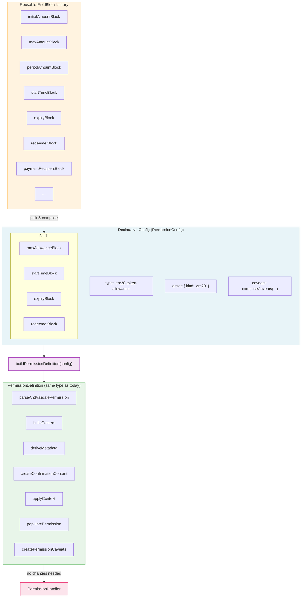

# Refactoring Proposal: Declarative Permission System

## 1. Problem

### 1.1 Current State

The system has 5 permission types, each requiring **7 files** totaling ~400 lines of code:

```
permissions/nativeTokenStream/
  ├── types.ts        (~50 lines)   — Zod schema + TypeScript types
  ├── validation.ts   (~90 lines)   — Request parsing and validation
  ├── context.ts      (~340 lines)  — buildContext / deriveMetadata / applyContext / populatePermission
  ├── rules.ts        (~200 lines)  — UI rule definitions (display, editing, validation)
  ├── caveats.ts      (~30 lines)   — On-chain caveat generation
  ├── content.tsx      (~50 lines)  — Confirmation dialog UI
  └── index.ts         (~40 lines)  — PermissionDefinition export
```

5 types × 7 files = **35 files**, with 60–70% duplicated boilerplate.

### 1.2 Pain Points

| Pain Point | Description |
|------------|-------------|
| **High cost to add** | Every new permission type requires 7 files, mostly copy-paste |
| **Native/ERC20 near-identical** | `nativeTokenStream` vs `erc20TokenStream` differ only in asset namespace and tokenAddress |
| **Duplicate rules** | `startTimeRule` is identical across 4 permission types, yet implemented separately in each |
| **Boilerplate context** | Token metadata fetch, CAIP address conversion, expiry extraction — repeated in every `context.ts` |
| **Manual factory** | `permissionHandlerFactory.ts` uses switch/case — must be manually updated for each new type |

### 1.3 Goal

Transform permission creation from **"imperatively implement 7 files"** to **"declaratively compose a config"** — like snapping Lego blocks together. Need a field? Add the block.

---

## 2. Design

### 2.1 Core Idea



**Key constraint**: `PermissionDefinition` and `PermissionHandler` remain unchanged. The builder generates output identical to what the hand-written code produces today.

### 2.2 Three Reusable Building Blocks

#### FieldBlock

Each `FieldBlock` encapsulates the full behavior of a single field:

```typescript
type FieldBlock = {
  name: string;                    // 'max-allowance', 'start-time', 'expiry', etc.
  zodSchema: z.ZodType;           // Zod validation fragment for this field
  rule: RuleTemplate;             // UI rule (label, type, getRuleData, updateContext)
  extractFromData: (data, decimals) => any;  // Permission data → context
  validate: (context) => string | undefined; // Validation in deriveMetadata
  applyToPermissionData: (context) => Record<string, any>; // Context → permission data
  isReadOnly?: boolean;           // x402 rules are read-only (not user-adjustable)
  defaultValue?: any;             // Default for populatePermission
};
```

**Pre-built instances (existing fields)**:
- `initialAmountBlock`, `maxAmountBlock`, `periodAmountBlock`
- `startTimeBlock`, `periodDurationBlock`, `timePeriodBlock`
- `streamAmountPerPeriodBlock`, `expiryBlock`

**New instances (x402 rules)**:
- `maxAllowanceBlock` — one-time allowance amount
- `redeemerBlock` — read-only address rule restricting who can redeem the permission
- `paymentRecipientBlock` — read-only address rule restricting payment recipients

#### CaveatBlock

```typescript
type CaveatBlock = {
  createCaveats: (args: {
    permission: PopulatedPermission;
    contracts: DelegationContracts;
  }) => Caveat[];
};

// Composition function
function composeCaveats(...blocks: CaveatBlock[]): CaveatBlock;
```

**Pre-built instances**:
- `nativeTransferGuard` — `exactCalldataEnforcer` (native token guard)
- `erc20ValueGuard` — `valueLteEnforcer` (ERC20 guard)
- `nativeStreamingCaveat`, `erc20StreamingCaveat`
- `nativePeriodicCaveat`, `erc20PeriodicCaveat`
- `erc20AllowanceCaveat` (new, for x402)
- `redeemerCaveat` (new, for x402)

#### AssetKind

```typescript
type AssetKind =
  | { kind: 'native' }   // slip44 namespace, no tokenAddress
  | { kind: 'erc20' }    // erc20 namespace, reads data.tokenAddress
  | { kind: 'none' };    // Revocation type, no token metadata
```

Drives the shared logic for token metadata fetching and CAIP address formatting.

### 2.3 Full PermissionConfig Type

```typescript
type PermissionConfig = {
  type: string;                   // 'erc20-token-allowance'
  asset: AssetKind;
  title: MessageKey;
  subtitle: MessageKey;
  fields: FieldBlock[];           // Declare needed fields
  caveats: CaveatBlock;           // Composed caveat strategy
  contentLayout?: ContentLayout;  // Optional custom UI layout
  overrides?: {                   // Escape hatch: override any generated function
    buildContext?: (...) => Promise<any>;
    deriveMetadata?: (...) => Promise<any>;
    applyContext?: (...) => Promise<any>;
    populatePermission?: (...) => Promise<any>;
  };
};
```

### 2.4 Registry

Replaces the switch/case in `permissionHandlerFactory.ts`:

```typescript
// Registration
registerPermission(erc20TokenAllowanceConfig);
registerPermission(erc20TokenPeriodicConfig);
// ...

// Lookup (called by factory)
const definition = getPermissionDefinition('erc20-token-allowance');
```

New permissions auto-register — no manual factory changes needed.

---

## 3. Concrete Examples

### 3.1 Example 1: One-off Payment

**Scenario**: A trading agent needs to pay $0.50 for token data via x402.

Permission request:
```json
{
  "type": "erc20-token-allowance",
  "justification": "Professional-grade token fundamentals; liquidity analysis, whale tracking, contract audits, developer activity, and predictive signals of the top 1,000 tokens",
  "isAdjustmentAllowed": true,
  "data": {
    "tokenAddress": "0xacA92E438df0B2401fF60dA7E4337B687a2435DA",
    "maxAllowance": "0x7A120",
    "startTime": 1775694112
  },
  "rules": [
    {
      "type": "expiry",
      "data": { "timestamp": 1775794112 }
    },
    {
      "type": "redeemer",
      "data": { "address": "0xMetaMaskFacilitatorAddress" }
    }
  ]
}
```

**Old way**: Create 7 files (types.ts, validation.ts, context.ts, rules.ts, caveats.ts, content.tsx, index.ts), ~400 lines of code.

**New way**: One config file, ~15 lines:

```typescript
// permissions/configs/erc20TokenAllowance.config.ts

export const erc20TokenAllowanceConfig: PermissionConfig = {
  type: 'erc20-token-allowance',
  asset: { kind: 'erc20' },
  title: 'permissionRequestTitle',
  subtitle: 'allowanceSubtitle',

  fields: [
    maxAllowanceBlock,     // ← Need maxAllowance? Add the block.
    startTimeBlock,        // ← Reuse existing startTime block
    expiryBlock,           // ← Reuse existing expiry block
    redeemerBlock,         // ← x402-specific rule block (read-only)
  ],

  caveats: composeCaveats(erc20AllowanceCaveat, erc20ValueGuard),
};
```

### 3.2 Example 2: Ongoing Budget

**Scenario**: An automated sprinkler system pays for recurring weather data with a monthly budget.

Permission request:
```json
{
  "type": "erc20-token-periodic",
  "justification": "Weather data for -local region- to help predict whether the garden needs watering",
  "isAdjustmentAllowed": true,
  "data": {
    "tokenAddress": "0xacA92E438df0B2401fF60dA7E4337B687a2435DA",
    "periodAmount": 5000000,
    "periodDuration": 2592000,
    "startTime": 1775694112
  },
  "rules": [
    {
      "type": "expiry",
      "data": { "timestamp": 1775794112 }
    },
    {
      "type": "redeemer",
      "data": { "address": "0xMetaMaskFacilitatorAddress" }
    }
  ]
}
```

**New way**:

```typescript
// permissions/configs/erc20TokenPeriodic.config.ts

export const erc20TokenPeriodicConfig: PermissionConfig = {
  type: 'erc20-token-periodic',
  asset: { kind: 'erc20' },
  title: 'permissionRequestTitle',
  subtitle: 'permissionRequestSubtitlePeriodic',

  fields: [
    periodAmountBlock,     // ← Reuse existing block
    periodDurationBlock,   // ← Reuse existing block
    startTimeBlock,
    expiryBlock,
    redeemerBlock,         // ← Just add this one line to support x402 redeemer rule
  ],

  caveats: composeCaveats(erc20PeriodicCaveat, erc20ValueGuard),
};
```

### 3.3 Key Insight

When x402 introduces new rules (e.g., `redeemer`, `payment-recipient`):

1. **Create once** — implement the `FieldBlock` (e.g., `redeemerBlock`)
2. **Snap onto any config** — add it to the `fields` array of any permission that needs it
3. **No other files change** — no 7-file ceremony, no factory updates

This is the value of the Lego-block pattern — **composition over duplication**.

---

## 4. Implementation Phases

Incremental migration — each phase is independently testable. No big-bang rewrite.

### Phase 1: Extract Shared Context Utilities

**Goal**: Reduce each permission's `context.ts` from ~300 lines to ~50 lines.

Extract into `src/permissions/builder/contextHelpers.ts`:
- `fetchTokenMetadata()` — token metadata + icon fetch (shared across all 5 types)
- `buildCaipAddresses()` — CAIP-10 account + CAIP-19 asset formatting
- `extractExpiryFromRules()` — expiry rule extraction
- `applyExpiryToRequest()` — wraps existing `applyExpiryRule`

Modify existing 5 `context.ts` files to call these helper functions.

### Phase 2: Create FieldBlock Abstractions

**Goal**: Define reusable "field blocks."

Create factory functions:
- `amountFieldBlock(config)` — amount fields
- `datetimeFieldBlock(config)` — time fields
- `dropdownFieldBlock(config)` — dropdown selection fields
- `expiryFieldBlock()` — wraps existing `createExpiryRule()`
- `addressFieldBlock(config)` — address fields (for redeemer / payment-recipient)

### Phase 3: Create CaveatBlock Abstractions

**Goal**: Make caveat creation composable.

Create independent `CaveatBlock` for each existing enforcer, plus `composeCaveats()` composition function.

### Phase 4: Builder + Registry

**Goal**: Implement `buildPermissionDefinition(config) → PermissionDefinition`.

The builder auto-generates all 7 dependency functions:
1. `parseAndValidatePermission` — composed from field Zod schemas
2. `buildContext` — from AssetKind + field extractors + Phase 1 helpers
3. `deriveMetadata` — from field validators
4. `createConfirmationContent` — from field rules + optional ContentLayout
5. `applyContext` — from field apply logic
6. `populatePermission` — from field defaults
7. `createPermissionCaveats` — from composed CaveatBlock

Registry replaces switch/case.

### Phase 5: Migrate Existing Permissions + Add x402 Types

**Migrate**: Convert 5 existing permission types from 7 files each to 1 config file each.

**Add new**: Use the Lego-block pattern to add x402 types (`erc20-token-allowance`, `native-token-allowance`).

**Escape hatch**: Revocation (no token metadata) and Stream (computed `amountPerSecond` / `totalExposure`) use the `overrides` field for genuinely unique logic.

**x402 rules as reusable blocks**: The `redeemer` and `payment-recipient` rules are implemented once as `FieldBlock` instances and snapped onto any permission config. When the `redeemer` address matches a known MetaMask facilitator, the UI shows an x402 payment note — this logic lives in `redeemerBlock`'s `getRuleData`, not scattered across types.

### Phase 6: Cleanup

- Modify `permissionHandlerFactory.ts`: switch/case → Registry lookup
- Delete 35 old files (5 permission directories)
- Update `addingNewPermissionTypes.md` documentation

---

## 5. Design Decisions

| Decision | Rationale |
|----------|-----------|
| Config objects, not class inheritance | Codebase is functional; configs compose naturally |
| `PermissionDefinition` interface unchanged | Zero impact on `PermissionHandler`; safe migration |
| Override escape hatch | Revocation + Stream have genuinely unique logic |
| Registry over switch/case | New permissions auto-register; no manual factory changes |
| Incremental phases | Each phase passes all tests independently |
| x402 rules as read-only FieldBlocks | Reflect dapp business logic; users cannot modify them |

---

## 6. Verification

After each phase:
1. `npm test` — all 867+ existing tests must pass
2. `npm run build` — TypeScript compilation must succeed

After Phase 5:
3. **Golden test**: For each permission type, verify the generated `PermissionDefinition` produces identical behavior by running existing test suites against the new config-generated definitions
4. **Manual test**: Request each permission type through the snap UI and verify the confirmation dialog renders correctly

---

## 7. File Summary

**New files** (~8 builder + ~8 configs = ~16 files):
- `packages/gator-permissions-snap/src/permissions/builder/`
  - `types.ts` — FieldBlock, AssetKind, PermissionConfig type definitions
  - `fieldBlocks.ts` — pre-built field blocks
  - `caveatBlocks.ts` — pre-built caveat blocks
  - `contextHelpers.ts` — shared context utility functions
  - `buildPermissionDefinition.ts` — core Builder
  - `registry.ts` — permission registry
- `packages/gator-permissions-snap/src/permissions/configs/`
  - 5 config files for existing permission types
  - 2 config files for new x402 permission types
  - `index.ts` — registers all configs

**Modified files** (2):
- `packages/gator-permissions-snap/src/core/permissionHandlerFactory.ts`
- `docs/addingNewPermissionTypes.md`

**Deleted files** (35):
- All files in 5 permission directories under `src/permissions/`
