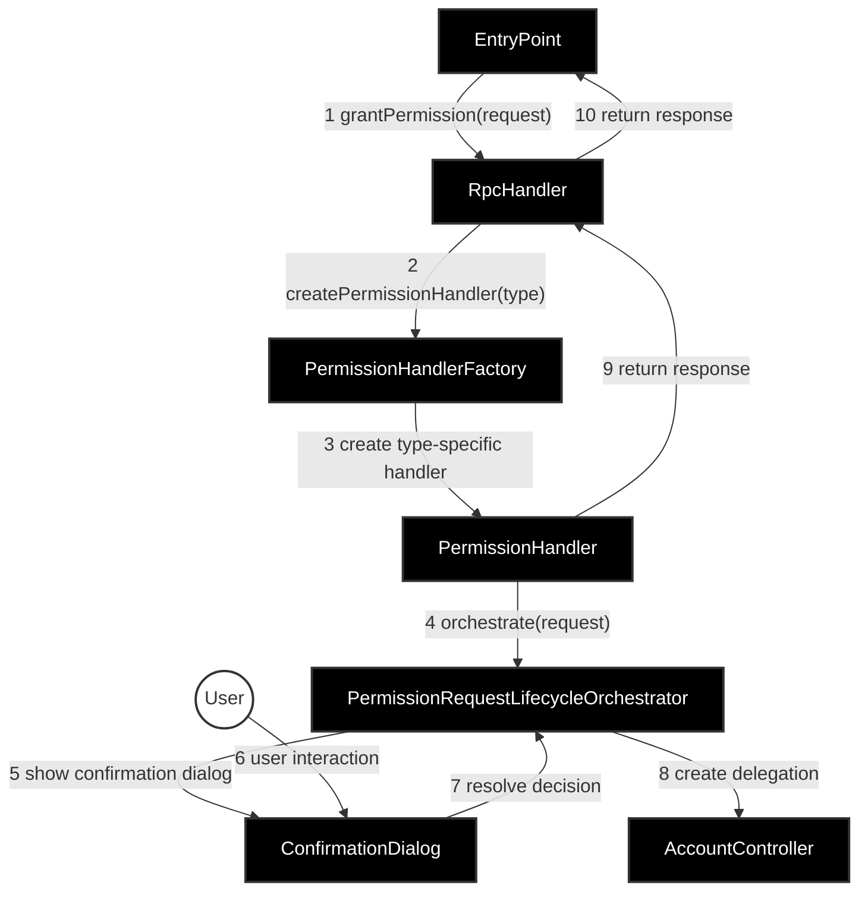
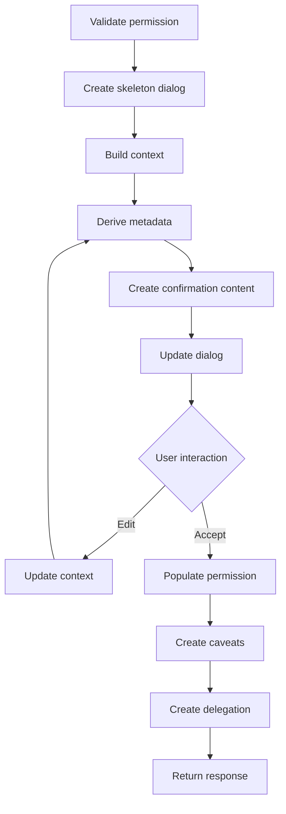

# Permissions Provider Snap Architecture

This document outlines the architecture of the Permissions Provider Snap system as implemented.

## Key Architectural Principles

1. **Permission-Specific Isolation**
   - Each permission type must be completely isolated in its own folder hierarchy
   - No permission-specific types, zod declarations, or logic should leak outside their folders
   - This includes validation schemas, context types, and UI components

2. **Hierarchical Organization**
   - Use barrel files sparingly, and always explicitly (i.e., no `export *`)
   - Leverage the folder hierarchy itself to organize code
   - This helps maintain clear boundaries between components

3. **Functional Dependencies**
   - Permission-specific logic is implemented through functional dependencies
   - Each function has a single responsibility (parse, validate, append caveats, etc.)
   - The orchestrator coordinates these functions without knowing their implementation details

4. **Dependency Injection**
   - Components receive their dependencies from the entrypoint, not from callers
   - Dependencies are explicitly typed and documented
   - This allows for easy testing and component replacement

## Component Descriptions

### Core Components

- **EntryPoint (index.ts)**: The main entrypoint for the snap. Sets up all services, dependencies, and lifecycle handlers. Connects RPC handlers and UserEventDispatcher to the Snaps runtime.
- **RpcHandler**: Functional RPC handler created by `createRpcHandler()` that responds to JSON-RPC requests from external systems. Supports three methods: grantPermission, getPermissionOffers, getGrantedPermissions.
- **PermissionHandlerFactory**: Creates and manages specific permission handlers using a generic PermissionHandler class with permission-specific type parameters and dependencies.
- **PermissionHandler**: A generic class used for all permission types, instantiated with permission-specific configuration and implementations to handle the complete permission lifecycle.
- **PermissionRequestLifecycleOrchestrator**: Orchestrates the complete permission request lifecycle across all permission types using handler-provided functions.
- **UserEventDispatcher**: Manages user input events from the snaps environment, providing event registration, cleanup, and sequential event processing.

### Service Components

- **AccountController**: Manages interactions with the user's EIP-7702 enabled EOA via the ethereum provider.
- **TokenPricesService**: Fetches token prices and calculates fiat conversions using user preferences.
- **TokenMetadataService**: Retrieves token balance and metadata from various sources (Account API, blockchain clients).
- **ProfileSyncManager**: Manages persistence of granted permissions to support syncronization across a user's devices, and permission revocation (revocation is implemented in MetaMask extension).
- **StateManager**: Handles persistent snap state storage and retrieval.

### Client Components

- **AccountApiClient**: Interfaces with the Account API for token metadata and balances on chains supported by the Account API.
- **BlockchainTokenMetadataClient**: Directly queries blockchain for token metadata on chains unsupported by the Account API.
- **PriceApiClient**: Fetches real-time token price data.

### UI Components

- **HomePage**: Component that builds the snap's homepage, showing feature introduction, as well as granted permissions. This is only part of the pre-production feature, as the snap will be pre-installed in which case the homepage is not accessible.
- **ConfirmationDialogFactory**: Creates confirmation dialogs for permission requests.
- **ConfirmationDialog**: Manages the lifecycle and user interaction of confirmation dialogs.

### Permission-Specific Components

Each permission type (native-token-stream, native-token-periodic, erc20-token-stream, erc20-token-periodic) includes:

- **Permission Definition**: Exports a `PermissionDefinition` object containing rules, title, and lifecycle function dependencies.
- **Types**: Permission-specific TypeScript types for requests, contexts, metadata, and permissions.
- **Validation**: Request parsing and validation logic.
- **Context**: Functions for building, applying, and populating permission context data.
- **Content**: UI components for permission-specific confirmation dialogs.
- **Rules**: Permission-specific validation rules and constraints.
- **Caveats**: Functions for creating permission-specific caveats.

## Folder Structure

```
src/
├── index.ts                   # Main entrypoint - dependency setup and lifecycle handlers
├── constants.ts               # Global constants
├── stateManagement.ts         # Snap state persistence utilities
├── userEventDispatcher.ts     # User input event management
├── core/                      # Core application logic and orchestration
├── rpc/                       # RPC request handling and method definitions
├── services/                  # Business logic services (token prices, metadata)
├── clients/                   # External API clients (Account API, Price API, blockchain)
├── profileSync/               # Cross-device permission storage synchronization
├── homepage/                  # Snap homepage UI component
├── ui/                        # Reusable UI components and utilities
├── utils/                     # Static utility functions
└── permissions/               # Permission-specific implementations
    ├── [shared files]         # Common validation utilities and permission offers
    ├── nativeTokenStream/     # Native token streaming permission implementation
    ├── nativeTokenPeriodic/   # Native token periodic transfer permission implementation
    ├── erc20TokenStream/      # ERC20 token streaming permission implementation
    └── erc20TokenPeriodic/    # ERC20 token periodic transfer permission implementation
```

### Folder Descriptions

- **`core/`**: Contains core application components including the permission handler factory, lifecycle orchestrator, confirmation dialogs, account controller, and shared type definitions.

- **`rpc/`**: Handles all RPC-related functionality including the main RPC handler factory, method definitions, and origin permission validation.

- **`services/`**: Business logic services that provide token pricing, metadata retrieval, and other domain-specific functionality.

- **`clients/`**: External API client implementations for interacting with the Account API, Price API, and blockchain providers.

- **`profileSync/`**: Manages encrypted storage and synchronization of granted permissions across devices using MetaMask's profile sync infrastructure.

- **`homepage/`**: Class-based component that builds the snap's homepage interface, displaying account information and granted permissions.

- **`ui/`**: Reusable UI components and utilities used across different permission types and dialogs.

- **`utils/`**: Static utility functions for common operations like address formatting, validation, time handling, and value conversion.

- **`permissions/`**: Permission-specific implementations, with each permission type having its own folder containing:
  - **Permission definition**: Exports the complete permission configuration with rules, title, and lifecycle functions
  - **Types**: TypeScript type definitions specific to the permission
  - **Validation**: Request parsing and validation logic
  - **Context**: Functions for building, applying, and populating permission context
  - **Content**: UI components for permission-specific confirmation dialogs
  - **Rules**: Permission-specific validation rules and constraints
  - **Caveats**: Functions for creating permission-specific caveats

## Component Overview



## Request Flow

1. A `grantPermission` request is received by the `EntryPoint` and passed to the `RpcHandler`'s `grantPermission` function
2. `RpcHandler` validates the request parameters and extracts permission requests and site origin
3. For each permission request, `PermissionHandlerFactory` creates a permission-specific `PermissionHandler` using the generic class with permission-specific type parameters and dependencies
4. `RpcHandler` calls the `handlePermissionRequest()` function on each `PermissionHandler`
5. `PermissionHandler` provides lifecycle functions to the `PermissionRequestLifecycleOrchestrator`
6. `PermissionRequestLifecycleOrchestrator` executes the lifecycle functions in sequence:
   - Validates the request using permission-specific validation
   - Builds the context using permission-specific context builders
   - Creates the confirmation dialog with skeleton content
   - Updates dialog with actual content once context is resolved
   - Manages user interaction and context updates
   - Processes the user's decision
   - Creates and signs the delegation
7. `PermissionHandler` returns the result to the `RpcHandler`
8. `RpcHandler` stores approved permissions via `ProfileSyncManager` for cross-device sync
9. Response is returned through the call stack

## Permission Request Lifecycle Orchestration

The `PermissionRequestLifecycleOrchestrator` implements a clear lifecycle for permission requests that defines distinct steps for the flow. This ensures that the implementation is flexible enough to accommodate different permission types while providing a consistent framework for permission-specific customizations.



## Component Deep Dive

### EntryPoint (index.ts)

The EntryPoint serves as the main initialization and configuration point for the snap. It's responsible for:

1. Setting up core dependencies and services:
   - Environment configuration (API URLs, supported chains, feature flags)
   - Client services (AccountApiClient, BlockchainTokenMetadataClient, PriceApiClient)
   - Core services (TokenMetadataService, TokenPricesService, AccountController)
   - State management (StateManager for snap persistence)
   - Profile sync (ProfileSyncManager for cross-device permission sync)
   - UI components (HomePage, ConfirmationDialogFactory, UserEventDispatcher)
   - Permission handling (PermissionHandlerFactory, PermissionRequestLifecycleOrchestrator)
   - RPC handling (createRpcHandler for processing requests)

2. Configuring RPC method bindings:
   - Maps RPC methods to their corresponding handlers
   - Supports `permissionsProvider_grantAttenuatedPermissions`, `permissionsProvider_getPermissionOffers`, and `permissionsProvider_getGrantedPermissions`

3. Handling lifecycle events:
   - `onRpcRequest`: Processes incoming JSON-RPC requests with origin validation
   - `onUserInput`: Handles user input events via UserEventDispatcher
   - `onHomePage`: Returns the snap's homepage content
   - `onInstall`: Shows welcome screen and handles local development setup

4. Managing dependencies and configuration:
   - Uses dependency injection to create and wire up components
   - Centralizes configuration of external services and feature flags
   - Provides environment-specific setup for local development

Key architectural points:

- Uses dependency injection extensively for loose coupling
- Centralizes all service configuration and initialization
- Provides clean separation between initialization and business logic
- Enforces origin-based access control for RPC methods
- Handles both production and development environment configurations

### UserEventDispatcher

The UserEventDispatcher is responsible for managing user input events from the snaps environment. It provides an event emitter interface that allows components to register and unregister handlers for specific user events.

Key architectural points:

- Provides a clean interface for handling user input events
- Manages event handler registration and cleanup
- Dispatches events to registered handlers sequentially to prevent race conditions
- Handles event handler errors gracefully without affecting other handlers
- Ensures only one component can create the user input event handler
- Supports debouncing for input change events while processing other events immediately

The UserEventDispatcher provides:

1. Event handler registration with `on()`:
   - Takes element name, event type, interface ID, and handler function
   - Creates unique event keys combining these parameters
   - Maintains a map of event keys to handler arrays
   - returns an `unbind()` function, to easily unbind the bound event

2. Event handler removal with `off()`:
   - Removes specific handlers from event key handler arrays
   - Handles cases where no handlers exist

3. Single user input event handler creation with `createUserInputEventHandler()`:
   - Can only be called once to ensure single ownership
   - Returns a function that processes incoming user input events
   - Dispatches events to all registered handlers for the event key
   - Executes handlers sequentially to prevent race conditions

### RpcHandler

The RpcHandler is created by the `createRpcHandler()` function and provides a clean interface for handling permission-related RPC methods. It coordinates with the PermissionHandlerFactory to process permission requests.

Key architectural points:

- Uses functional approach rather than class-based architecture
- Validates incoming permission request parameters
- Coordinates with PermissionHandlerFactory to create permission-specific handlers
- Handles multiple permission requests in parallel
- Integrates with ProfileSyncManager to store approved permissions
- Returns filtered arrays of valid permission responses

The RpcHandler provides three main functions:

1. `grantPermission()`:
   - Validates incoming permission request parameters
   - Extracts permissions request array and site origin
   - Creates appropriate permission handlers for each permission request
   - Processes permission requests in parallel using Promise.all
   - Stores approved permissions via ProfileSyncManager
   - Returns array of permission responses

2. `getPermissionOffers()`:
   - Returns the default permission offers that the snap supports
   - Currently supports 4 permission types: native-token-stream, native-token-periodic, erc20-token-stream, erc20-token-periodic

3. `getGrantedPermissions()`:
   - Retrieves all previously granted permissions from ProfileSyncManager
   - Returns permissions for cross-device synchronization

### PermissionHandlerFactory

The PermissionHandlerFactory creates permission-specific handlers using a generic `PermissionHandler` class. It provides a centralized factory for instantiating handlers with all required dependencies and permission-specific configurations.

Key architectural points:

- Uses a factory pattern for creating permission handlers
- Manages dependencies required by handlers (services, orchestrator, user event dispatcher)
- Creates instances of the generic PermissionHandler class with permission-specific type parameters
- Supports extensibility for new permission types through a simple switch statement
- Ensures consistent dependency injection across all permission types

The factory provides:

1. Permission handler creation via `createPermissionHandler()`:
   - Extracts permission type from request using `extractPermissionName()`
   - Creates generic PermissionHandler instances with permission-specific configurations
   - Injects base dependencies (AccountController, services, orchestrator)
   - Uses permission definitions imported from each permission type folder
   - Supports four permission types: native-token-stream, native-token-periodic, erc20-token-stream, erc20-token-periodic

Each permission type provides a `PermissionDefinition` object containing:

- `rules`: Permission-specific validation rules and UI constraints
- `title`: Human-readable permission name
- `dependencies`: Object containing all lifecycle functions (parseAndValidatePermission, buildContext, deriveMetadata, createConfirmationContent, applyContext, populatePermission, createPermissionCaveats)

### PermissionHandler

The `PermissionHandler` is a generic class that implements the `PermissionHandlerType` interface. All permission types use this same handler class, but it is instantiated with different type parameters and injected dependencies for each permission type.

Key architectural points:

- Single generic class used for all permission types with type parameters for request, context, metadata, and permission types
- Permission-specific logic is injected through the dependencies object from permission definitions
- Coordinates between permission-specific logic and the common lifecycle orchestrator
- Uses dependency injection for required services and orchestrator
- Prevents multiple permission request handling on the same instance
- Manages state and renders UI for shared logic such as Granting address, token balance etc.

The handler provides:

1. `handlePermissionRequest()`:
   - Ensures single-use pattern (can only handle one request per instance)
   - Delegates to the PermissionRequestLifecycleOrchestrator with permission-specific lifecycle handlers
   - Returns permission request results (approved/rejected with reasons)

2. Lifecycle handler coordination via `#getLifecycleHandlers()`:
   - Provides permission-specific functions to the orchestrator
   - Includes validation, context building, UI creation, and delegation creation
   - Handles token balance fetching and price conversion
   - Manages UI updates and user interaction callbacks

### PermissionRequestLifecycleOrchestrator

The PermissionRequestLifecycleOrchestrator manages the complete lifecycle of permission requests across all permission types. It provides a template method pattern that defines the core flow while allowing permission-specific handlers to provide customized implementations for each step.

Key architectural points:

- Provides a common lifecycle for all permission types
- Uses handler-provided functions for permission-specific steps
- Manages confirmation dialog creation and updates
- Handles user decision processing and context updates
- Creates and manages delegations through AccountController
- Supports adjustment workflows where users can modify permission parameters

The orchestrator manages the following lifecycle:

1. **Initial Setup**:
   - Ensures account addresses are available
   - Validates permission requests using handler-provided validators

2. **Dialog Management**:
   - Creates confirmation dialogs with skeleton content initially
   - Builds context data using handler-provided context builders
   - Updates dialogs with actual content once context is resolved
   - Manages real-time UI updates based on user interaction

3. **User Interaction**:
   - Handles user input for permission parameter adjustments
   - Validates changes and updates UI accordingly
   - Processes approval or rejection decisions

4. **Delegation Creation**:
   - Populates permissions based on user decisions
   - Appends permission-specific caveats
   - Creates and signs delegations through AccountController

### ConfirmationDialogFactory & ConfirmationDialog

The ConfirmationDialogFactory creates confirmation dialogs that handle user interaction during permission requests, while ConfirmationDialog manages the complete dialog lifecycle.

**ConfirmationDialogFactory** provides:

- Factory pattern for creating confirmation dialogs
- Dependency injection for snaps provider and user event dispatcher
- Consistent dialog structure across permission types

**ConfirmationDialog** manages:

- Complete dialog lifecycle from creation to cleanup
- User input event handling through UserEventDispatcher
- Dynamic content updates based on context changes
- Promise-based user decision resolution
- Event handler cleanup and resource management

Key features:

- Supports dynamic content updates during user interaction
- Handles both grant and cancel user decisions
- Manages UI state for complex form interactions
- Integrates with UserEventDispatcher for event handling
- Provides clean teardown and resource cleanup

### ProfileSyncManager

The ProfileSyncManager handles synchronization of granted permissions to encrypted user storage for cross-device access. It provides a complete storage and retrieval system for permission data.

Key features:

- Encrypts and stores permissions in user's profile storage
- Supports batch operations for bulk permission storage
- Generates unique keys for permissions based on delegation hashes
- Handles authentication with the profile sync service
- Provides feature flag support for controlled rollout
- Falls back gracefully when profile sync is disabled

The manager provides:

- `getAllGrantedPermissions()`: Retrieves all stored permissions
- `getGrantedPermission()`: Retrieves specific permission by context hash
- `storeGrantedPermission()`: Stores single permission
- `storeGrantedPermissionBatch()`: Stores multiple permissions efficiently

### Services

**TokenPricesService**: Fetches real-time token prices and calculates fiat conversions

- Integrates with external price APIs
- Respects user's currency preferences from MetaMask
- Provides fallback handling for API failures
- Calculates crypto-to-fiat conversions for permission amounts

**TokenMetadataService**: Retrieves token balance and metadata

- Uses Account API for supported chains (mainnet)
- Falls back to blockchain clients for unsupported chains
- Fetches token balance, decimals, symbols, and icons
- Converts icons to base64 data URIs for display

**StateManager**: Handles snap state persistence

- Provides encrypted and unencrypted storage options
- Used for profile sync authentication sessions and storage keys
- Simple get/set interface for snap state management

This architecture ensures a clean separation of concerns while maintaining flexibility for different permission types and providing a consistent user experience across all permission workflows.
