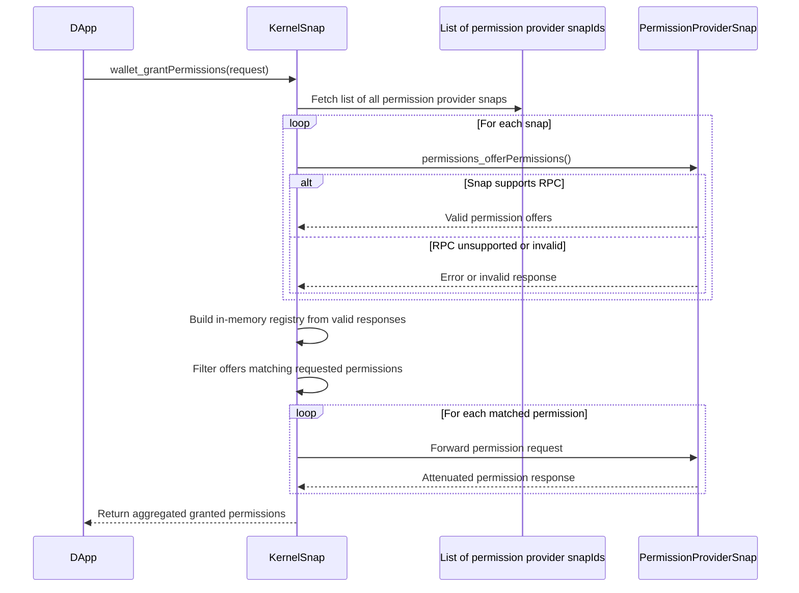

# Ephemeral permissions offer registry

## **Brute force approach(v1)**

Given that there is only a single permission provider(ie, gator-snap) participating in the permission system, we can start with a brute-force algorithm that has **quadratic complexity** in the number of permission provider installed snaps and the number of participating permission providers.

- Permission provider Snap developers will maintain control over their participation in the permission system, requiring only the release of a new version of their Snap to opt in or out of the permission system.

**\*Complexity**: O(a^2 + b^2), where:\*

- _`a` is the total number of permission provider snaps a user has installed_
- _`b` is the number of snaps that support the requested permission(s)_

**Steps**

1. DApp calls `wallet_grantPermissions` on the Kernel Snap.
2. Kernel makes async RPC calls to all registered permission provider snaps using `permissionProvider_getPermissionOffers` to fetch permission offers.
   1. A standard `permissionProvider_getPermissionOffers` rpc must be implemented by the permission provider snap to participate in the permission system.
      1. If the permission provider snap returns with an error, it does not support the RPC and will not participate in the permission system.
      2. If the permission provider snap returns an invalid result, it will not participate in the permission system.
3. The kernel will aggregate all valid responses from the permission provider snap as an in-memory registry.
4. Once the registry is built, the kernel filters all permissions that match the permissions requested by the dapp.
   1. The filter could map to multiple providers as a source for a given permission. (These are all to Gator Snap v1.)
5. Matching permission requests are forwarded to the respective provider(s), one at a time(ie. sequentially).
   1. Each permission provider will allow the user to attenuate and return a response.
6. Final granted permissions are aggregated and returned to the DApp.(These are all to Gator Snap v1.)
7. The ephemeral registry state is cleared, and the next request will rebuild the offers.

### **The requirement for permission provider snaps to opt into the permission system**

1. Support `permissionProvider_getPermissionOffers` RPC
2. Support `permissionsProvider_grantPermissions` RPC to allow the kernel to forward `wallet_grantPermission` payload.

### **The requirement to leave the permission system**

1. The permission provider snap will no longer return a valid response for the `permissionProvider_getPermissionOffers` RPC.
   1. Opt-out can be implemented as an update to the developer's permission provider snap or through more dynamic solutions that support HTTPS network calls to toggle support.

### **Known Bottlenecks**

- Full registry rebuild on every request
- Sequential forwarding of permission requests
- No caching or persistence layer for permission provider to kernel-snap relationships

## Reference

- [Wallet API for Snaps](https://docs.metamask.io/snaps/reference/wallet-api-for-snaps/)
