# Permissions Provider Snap Architecture

This document outlines the aspirational architecture of the Permissions Provider Snap system. 

## Key Architectural Principles

1. **Permission-Specific Isolation**
   - Each permission type must be completely isolated in its own folder hierarchy
   - No permission-specific types, zod declarations, or logic should leak outside their folders
   - This includes validation schemas, context types, and UI components

2. **Hierarchical Organization**
   - Avoid using barrel files as facades as this flattens heirarchy and removes structure
   - Leverage the folder hierarchy itself to organize code
   - This helps maintain clear boundaries between components

3. **Functional Dependencies**
   - Permission-specific logic is implemented through functional dependencies
   - Each function has a single responsibility (parse, validate, append caveats, etc.)
   - The orchestrator coordinates these functions without knowing their implementation details

4. **Dependency Injection**
   - As much as possible components receive their dependencies from the entrypoint, and not from the caller.
   - Dependencies are explicitly typed and documented
   - This allows for easy testing and component replacement

## Component Descriptions

### Core Components
- **EntryPoint**: The main entrypoint for the snap. Connects the RpcHandler, and UserEventDispatcher to the Snaps runtime. Instantiates dependencies, but this may move to a standalone component in the future if required.
- **RpcHandler**: Responds to RPC requests from external systems.
- **UserEventDispatcher**: Receives UserEvents from the snaps environment, and exposes them via an event emitter interface.
- **OrchestratorFactory**: Creates and manages specific permission orchestrators.

### Confirmation Components
- **ConfirmationDialogFactory**: Creates and manages confirmation dialogs for permission requests.

### Permission-Specific Components
- **PermissionOrchestrator**: Handles the logic for specific permission types.
- **Confirmation Content**: Permission-specific confirmation dialog content.

## Folder Structure

```
src/
├── index.ts                   # EntryPoint
├── confirmation/              # Confirmation dialog logic
├── core/                      # Core application logic
├── ui/                        # Reusable UI components
├── utils/                     # Static utilities
├── services/                  # Interfaces to external services
└── permissions/               # Permission-specific implementations
    └── [specific permission]/ # Other permission types live in their own folder
```

## Component Overview

```mermaid
graph TD
    EntryPoint[EntryPoint]
    RpcHandler[RpcHandler]
    OrchestratorFactory[OrchestratorFactory]
    BaseOrchestrator[BaseOrchestrator]
    ConfirmationDialogFactory[ConfirmationDialogFactory]
    ConfirmationDialog[ConfirmationDialog]
    UserEventDispatcher[UserEventDispatcher]
    User((User))

    %% Request Flow
    EntryPoint -->|"1 grantPermission(request)"| RpcHandler
    RpcHandler -->|"2 createOrchestrator(type)"| OrchestratorFactory
    OrchestratorFactory -->|"3 create type-specific orchestrator"| BaseOrchestrator
    BaseOrchestrator -->|"4 createConfirmation(ui)"| ConfirmationDialogFactory
    ConfirmationDialogFactory -->|"5 create dialog"| ConfirmationDialog
    ConfirmationDialog -->|"6 register handlers"| UserEventDispatcher
    User -->|"7 user interaction"| ConfirmationDialog
    ConfirmationDialog -->|"8 resolve decision"| BaseOrchestrator
    BaseOrchestrator -->|"9 return response"| RpcHandler
    RpcHandler -->|"10 return response"| EntryPoint

    %% Style
    classDef component fill:#000,stroke:#333,stroke-width:2px;
    classDef user fill:#fff,stroke:#333,stroke-width:2px;
    class EntryPoint,RpcHandler,OrchestratorFactory,BaseOrchestrator,ConfirmationDialogFactory,ConfirmationDialog,UserEventDispatcher component;
    class User user;
```



## Request Flow

1. A `grantPermission` request is received by the `EntryPoint` and passed to the `RpcHandler`'s `grantPermission` function
2. `RpcHandler` validates the request is a valid `PermissionRequest` and extracts the permission type
3. `OrchestratorFactory` creates a `PermissionOrchestrator` for the permission type
4. `RpcHandler` calls the `orchestrate()` function on the `PermissionOrchestrator`
5. `PermissionOrchestrator` creates content for the confirmation dialog using the `PermissionSpecificConfirmationContent`
6. `PermissionOrchestrator` provides the content for the confirmation dialog
7. `PermissionOrchestrator` creates a confirmation dialog using the `ConfirmationDialogFactory`
8. `PermissionOrchestrator` registers event handlers with the `UserEventDispatcher`
9. `ConfirmationDialogFactory` presents the dialog to the user and awaits their decision
10. User grants the permission through the dialog
11. `PermissionOrchestrator` unregisters event handlers from the `UserEventDispatcher`
12. `PermissionOrchestrator` returns the granted context to the `PermissionOrchestrator`
13. `PermissionOrchestrator` builds the final permission delegation
14. Response is returned through the call stack

## Orchestrator Request Lifecycle
The Orchestrators implement a clear lifecycle for permission requests in `BaseOrchestrator` that defines distinct steps for the flow. Ensuring that the implementation ss flexible enough to accommodate different permission types while providing a consistent framework for permission-specific customizations.

   ```mermaid
   flowchart TD
       A[Validate permission] --> B[Create context]
       B --> C[Create dialog]
       C --> D[Derive metadata]
       D --> E[Update dialog]
       E --> F{Edit or Accept}
       F -->|Edit UI| G[Update context]
       G --> D
       F -->|Accept permission| H[Derive updated permission]
       H --> I[Hydrate permission]
       I --> J[Return response]
   ```

## Component Deep Dive

### EntryPoint

The EntryPoint serves as the main initialization and configuration point for the snap. It's responsible for:

1. Setting up core dependencies and services:
   - AccountController for managing smart accounts and delegations
   - TokenPricesService for fetching token price data
   - UserEventDispatcher for handling user input events
   - ConfirmationDialogFactory for creating permission confirmation dialogs
   - OrchestratorFactory for creating permission-specific orchestrators
   - RpcHandler for processing incoming RPC requests

2. Configuring RPC method bindings:
   - Maps RPC methods to their corresponding handlers
   - Currently supports `permissionsProvider_grantAttenuatedPermissions`

3. Handling lifecycle events:
   - `onRpcRequest`: Processes incoming JSON-RPC requests
   - `onUserInput`: Handles user input events
   - `onHomePage`: Builds and returns the snap's homepage content
   - `onInstall`: Shows the welcome screen on snap installation

4. Managing the connection between the snap runtime and internal components:
   - Validates request origins against allowed origins
   - Routes requests to appropriate handlers
   - Manages error handling and response formatting

Key architectural points:
- Uses dependency injection to create and wire up components
- Centralizes configuration of external services (e.g., price API)
- Provides a clean interface for the snap runtime to interact with internal components
- Enforces origin-based access control for RPC methods
- Maintains a clear separation between initialization and business logic

The `entrypoint` contains the "startup" code for the application, instantiating dependencies, connecting them to each other and lifecycle handlers. No business logic exists in the `EntryPoint` aside from request origin validation, which could logically live in the `RpcHandler`, but this allows for a simple overarching method to validate the caller.

### UserEventDispatcher

The UserEventDispatcher is responsible for managing user input events from the snaps environment. It provides a simple event emitter interface that allows components to register and unregister handlers for specific user events.

Key architectural points:
- Provides a clean interface for handling user input events
- Manages event handler registration and cleanup
- Dispatches events to registered handlers
- Handles event handler errors gracefully
- Ensures only one component can handle user input events

The UserEventDispatcher provides a simple interface for:
1. Registering event handlers with `on()`:
   - Takes element name, event type, interface ID, and handler function
   - Creates a unique event key combining these parameters
   - Maintains a map of event keys to handler arrays
   - Returns self for method chaining

2. Unregistering event handlers with `off()`:
   - Removes specific handlers from the event key's handler array
   - Handles cases where no handlers exist
   - Returns self for method chaining

3. Creating a single user input event handler with `createUserInputEventHandler()`:
   - Can only be called once to ensure single ownership
   - Returns a function that processes incoming user input events
   - Dispatches events to all registered handlers for the event key
   - Handles errors in individual handlers without affecting others
   - Executes handlers concurrently using Promise.all

The dispatcher is used by:
- ConfirmationDialog for handling button clicks and form submissions
- PermissionOrchestrator for managing state changes in permission requests
- `BaseOrchestrator` for coordinating UI updates and state management

This allows components to handle user input events without needing to know about the snaps environment or the details of how events are dispatched, while ensuring that only one component can handle user input events.

### RpcHandler

The RpcHandler is responsible for processing incoming JSON-RPC requests from the snaps environment. It provides a clean interface for handling permission-related RPC methods and coordinates with the OrchestratorFactory to process permission requests.

Key architectural points:
- Provides a type-safe interface for RPC method handlers
- Validates incoming permission request parameters
- Coordinates with OrchestratorFactory to process permission requests
- Handles multiple permission requests in parallel
- Filters and returns only valid permission responses

The RpcHandler provides the following functionality:
1. Grant Permission Requests:
   - Validates incoming permission request parameters
   - Extracts permissions request and site origin
   - Creates appropriate orchestrators for each permission request
   - Processes permission requests in parallel
   - Returns filtered array of valid permission responses

The handler is used by:
- EntryPoint for processing incoming RPC requests
- OrchestratorFactory for creating permission-specific orchestrators
- PermissionOrchestrator for handling individual permission requests

This allows the snap to handle permission-related RPC requests in a type-safe and organized manner, while ensuring proper validation and processing of permission requests.

### OrchestratorFactory

The OrchestratorFactory is responsible for creating permission-specific orchestrators based on the type of permission request. It provides a centralized factory for instantiating the appropriate orchestrator with all required dependencies.

Key architectural points:
- Provides a factory pattern for creating permission orchestrators
- Manages dependencies required by orchestrators
- Supports extensibility for new permission types
- Ensures consistent dependency injection
- Maintains type safety across permission types

The factory provides the following functionality:
1. Creating Permission Orchestrators:
   - Extracts permission type from request
   - Provides base dependencies to all orchestrators
   - Creates type-specific orchestrators with additional dependencies
   - Throws error for unsupported permission types

The factory is used by:
- RpcHandler for creating orchestrators to handle permission requests
- `BaseOrchestrator` for providing common functionality to all orchestrators
- Permission-specific orchestrators (e.g., NativeTokenStreamOrchestrator)

This allows the system to handle different types of permission requests in a modular and extensible way, while ensuring consistent dependency management and type safety.

### Orchestrators

Orchestrators are permission-specific components that handle the complete lifecycle of permission requests. Each orchestrator inherits from the `BaseOrchestrator` abstract class, which provides the core template for handling permission requests while allowing specific implementations to customize behavior for their permission type.

Key architectural points:
- Each permission type has its own orchestrator implementation
- All orchestrators inherit from `BaseOrchestrator`
- Provides a template method pattern for permission request handling
- Manages the complete lifecycle of permission requests
- Coordinates between UI, validation, and delegation creation

The orchestrator pattern provides the following functionality:
1. Permission Request Flow:
   - Builds permission-specific context from request
   - Creates and manages confirmation dialog
   - Handles user input events and state changes
   - Resolves permission request with user input
   - Creates and signs permission delegations

2. State Management:
   - Tracks UI state for permission-specific forms
   - Manages validation state and error handling
   - Coordinates with external services as needed
   - Updates UI based on user input and validation

The orchestrator pattern is used by:
- OrchestratorFactory for creating type-specific orchestrators
- ConfirmationDialog for UI interaction
- UserEventDispatcher for handling user input
- AccountController for managing permissions

This pattern allows each permission type to implement its own specific logic while maintaining a consistent structure and flow for permission requests. The template method pattern ensures that all permission types follow the same high-level flow while allowing for customization of specific behaviors.

### ConfirmationDialogFactory

The ConfirmationDialogFactory is responsible for creating confirmation dialogs that handle user interaction during permission requests. It provides a factory pattern for instantiating confirmation dialogs with the necessary dependencies.

Key architectural points:
- Provides a factory pattern for creating confirmation dialogs
- Manages dependencies required by confirmation dialogs
- Ensures consistent UI structure across permission types
- Coordinates with UserEventDispatcher for event handling
- Maintains type safety for UI components

The factory provides the following functionality:
1. Creating Confirmation Dialogs:
   - Takes UI elements as input
   - Provides snaps provider and event dispatcher
   - Creates ConfirmationDialog instances
   - Ensures consistent dialog structure

The factory is used by:
- PermissionOrchestrator for creating confirmation dialogs
- ConfirmationDialog for managing dialog lifecycle
- UserEventDispatcher for handling user input events

This allows the system to present consistent and type-safe confirmation dialogs to users while managing the dialog lifecycle and user interactions in a centralized way.

### ConfirmationDialog

The ConfirmationDialog is responsible for managing the lifecycle and user interaction of permission confirmation dialogs. It provides a clean interface for creating, updating, and resolving confirmation dialogs.

Key architectural points:
- Manages the complete lifecycle of confirmation dialogs
- Handles user input events through UserEventDispatcher
- Provides a clean interface for updating dialog content
- Maintains state for UI elements (e.g., justification collapse)
- Coordinates with SnapsProvider for UI updates

The dialog provides the following functionality:
1. Dialog Lifecycle:
   - Creates and manages dialog interface
   - Updates dialog content dynamically
   - Cleans up event handlers and resources

2. User Interaction:
   - Updates UI state based on instructions from other components
   - Resolves dialog with user decision (grant / cancel)

3. UI Management:
   - Builds confirmation dialog structure
   - Updates content dynamically
   - Maintains consistent footer across dialogs

The dialog is used by:
- PermissionOrchestrator for presenting confirmation UI
- UserEventDispatcher for handling user input
- SnapsProvider for UI updates
- ConfirmationFooter for consistent button handling

This allows the system to present consistent and type-safe confirmation dialogs to users while managing the dialog lifecycle and user interactions in a centralized way.

