# Permissions Provider Snap Architecture

This document outlines the aspirational architecture of the Permissions Provider Snap system. 

## Key Architectural Principles

1. **Permission-Specific Isolation**
   - Each permission type must be completely isolated in its own folder hierarchy
   - No permission-specific types, zod declarations, or logic should leak outside their folders
   - This includes validation schemas, context types, and UI components

2. **Hierarchical Organization**
   - Avoid using barrel files as facades as this flattens heirarchy and removes structure
   - Leverage the folder hierarchy itself to organize code
   - This helps maintain clear boundaries between components

3. **Functional Dependencies**
   - Permission-specific logic is implemented through functional dependencies
   - Each function has a single responsibility (parse, validate, append caveats, etc.)
   - The orchestrator coordinates these functions without knowing their implementation details

4. **Dependency Injection**
   - As much as possible components receive their dependencies from the entrypoint, and not from the caller.
   - Dependencies are explicitly typed and documented
   - This allows for easy testing and component replacement

## Component Descriptions

### Core Components
- **EntryPoint**: The main entrypoint for the snap. Connects the RpcHandler, and UserEventDispatcher to the Snaps runtime. Instantiates dependencies, but this may move to a standalone component in the future if required.
- **RpcHandler**: Responds to RPC requests from external systems.
- **UserEventDispatcher**: Receives UserEvents from the snaps environment, and exposes them via an event emitter interface.
- **OrchestratorFactory**: Creates and manages specific permission orchestrators.
- **AccountController**: Manages account-related operations and state.
- **TokenPricesService**: Provides token price information and conversion services.

### Confirmation Components
- **ConfirmationDialogFactory**: Creates and manages confirmation dialogs for permission requests.

### Permission-Specific Components
- **PermissionRequestOrchestrator**: Handles the logic for specific permission types.
- **Confirmation Content**: Permission-specific confirmation dialog content.

## Folder Structure

```
src/
├── index.ts                   # EntryPoint (required by snaps system)
│
├── core/                      # Core application components
│   ├── rpcHandler.ts          # RpcHandler
│   ├── userEventDispatcher.ts # UserEventDispatcher
│   ├── orchestratorFactory.ts # OrchestratorFactory
│   ├── accountController.ts   # AccountController
│   ├── tokenPricesService.ts  # TokenPricesService
│   ├── permission.ts          # Base permission types and validation
│   ├── context.ts             # Base context types
│   └── response.ts            # Response types
│
├── confirmation/              # Confirmation dialog components
│   ├── factory.ts             # ConfirmationDialogFactory
│   ├── types.ts               # Shared confirmation types
│   └── content/               # Base confirmation content
│       ├── types.ts           # ConfirmationContent interface
│       └── components/        # Shared confirmation UI components
│
└── permissions/               # Permission-specific implementations
    ├── nativeTokenStream/     # Native token stream permission
    │   ├── orchestrator.ts    # PermissionRequestOrchestrator
    │   ├── validation.ts      # ParseAndValidatePermission
    │   ├── caveats.ts         # AppendCaveats
    │   ├── types.ts           # Permission-specific types
    │   └── confirmation/      # Permission-specific confirmation
    │       ├── content.ts     # ConfirmationContent
    │       └── components/    # Permission-specific UI components
    │
    └── [otherPermissions]/    # Other permission types follow same structure
```

## Component Overview

```mermaid
graph TD
    EntryPoint[EntryPoint]
    RpcHandler[RpcHandler]
    UserEventDispatcher[UserEventDispatcher]
    OrchestratorFactory[OrchestratorFactory]
    ConfirmationDialogFactory[ConfirmationDialogFactory]

    PermissionLabel[Permission Specific Components]
    PermissionLabel -.- PermissionSpecific

    subgraph PermissionSpecific[" "]
        style PermissionSpecific fill:none,stroke:#333,stroke-width:2px
        PermissionRequestOrchestrator[PermissionRequestOrchestrator]
        PermissionSpecificConfirmationContent[PermissionSpecificConfirmationContent]
    end

    User((User))

    %% Request Flow
    EntryPoint -->|"1 grantPermission(request)"| RpcHandler
    RpcHandler -->|"2 createOrchestrator(type)"| OrchestratorFactory
    OrchestratorFactory -->|"3 constructor(deps)"| PermissionRequestOrchestrator
    RpcHandler -->|"4 orchestrate(request)"| PermissionRequestOrchestrator
    PermissionRequestOrchestrator -->|"5 createContent(...)"| PermissionSpecificConfirmationContent
    PermissionSpecificConfirmationContent -->|"6 content"| PermissionRequestOrchestrator
    PermissionRequestOrchestrator -->|"7 createConfirmation(...)"| ConfirmationDialogFactory
    ConfirmationDialogFactory -->|"8 on(handlers)"| UserEventDispatcher
    User -->|"9 User grants permission"| ConfirmationDialogFactory
    ConfirmationDialogFactory -->|"10 off(handlers)"| UserEventDispatcher
    ConfirmationDialogFactory -->|"11 return grantedContext"| PermissionRequestOrchestrator
    PermissionRequestOrchestrator -->|"12 return response"| RpcHandler
    RpcHandler -->|"13 return response"| EntryPoint

    %% Style
    classDef component fill:#000,stroke:#333,stroke-width:2px;
    classDef label fill:none,stroke:none;
    classDef user fill:#fff,stroke:#333,stroke-width:2px;
    class EntryPoint,RpcHandler,UserEventDispatcher,OrchestratorFactory,PermissionRequestOrchestrator,ConfirmationDialogFactory,PermissionSpecificConfirmationContent component;
    class PermissionLabel label;
    class User user;
```



## Request Flow

1. A `grantPermission` request is received by the `EntryPoint` and passed to the `RpcHandler`'s `grantPermission` function
2. `RpcHandler` validates the request is a valid `PermissionRequest` and extracts the permission type
3. `OrchestratorFactory` creates a `PermissionRequestOrchestrator` for the permission type
4. `RpcHandler` calls the `orchestrate()` function on the `PermissionRequestOrchestrator`
5. `PermissionRequestOrchestrator` creates content for the confirmation dialog using the `PermissionSpecificConfirmationContent`
6. `PermissionSpecificConfirmationContent` provides the content for the confirmation dialog
7. `PermissionRequestOrchestrator` creates a confirmation dialog using the `ConfirmationDialogFactory`
8. `ConfirmationDialogFactory` registers event handlers with the `UserEventDispatcher`
9. `ConfirmationDialogFactory` presents the dialog to the user and awaits their decision
10. User grants the permission through the dialog
11. `ConfirmationDialogFactory` unregisters event handlers from the `UserEventDispatcher`
12. `ConfirmationDialogFactory` returns the granted context to the `PermissionRequestOrchestrator`
13. `PermissionRequestOrchestrator` builds the final permission delegation
14. Response is returned through the call stack

## Component Deep Dive

### EntryPoint

The EntryPoint serves as the main initialization and configuration point for the snap. It's responsible for:

1. Setting up core dependencies and services
2. Configuring RPC method bindings
3. Handling lifecycle events (install, homepage, etc.)
4. Managing the connection between the snap runtime and internal components

Key architectural points:
- Uses dependency injection to create and wire up components
- Centralizes configuration of external services (e.g., price API)
- Provides a clean interface for the snap runtime to interact with internal components

```typescript
// Core dependencies setup
const accountController = new AccountController({/* dependencies */});
const tokenPricesService = new TokenPricesService({/* dependencies */});
const userEventDispatcher = new UserEventDispatcher({/* dependencies */});
const confirmationDialogFactory = new ConfirmationDialogFactory({/* dependencies */});
const orchestratorFactory = new OrchestratorFactory({/* dependencies */});
const rpcHandler = new RpcHandler({/* dependencies */});
const homePage = new HomePage({/* dependencies */});

// RPC method bindings
const boundRpcHandlers = {
  [RpcMethod.PermissionProviderGrantAttenuatedPermissions]: 
    rpcHandler.grantPermission.bind(rpcHandler),
};

// Snap lifecycle handlers
export const onRpcRequest: OnRpcRequestHandler = async ({ origin, request }) => {
   // ensure that the caller is allowed to make this request
  if (!isMethodAllowedForOrigin(origin, request.method)) {
    throw new Error(
      `Origin '${origin}' is not allowed to call '${request.method}'`,
    );
  }
  
  const handler = boundRpcHandlers[request.method];

  if (!handler) {
    throw new Error(`Method ${request.method} not found.`);
  }

  return await handler(request.params);
};

export const onUserInput: OnUserInputHandler = async (args) =>
  userEventDispatcher.handleUserInputEvent(args);

export const onHomePage: OnHomePageHandler = async () => ({
  content: await homepage.buildHomepage(),
});

export const onInstall: OnInstallHandler = async () => {
  await homepage.showWelcomeScreen();
};
```

The `entrypoint` contains the "startup" code for the application, instantiating dependencies, connecting them to each other and lifecycle handlers. No business logic exists in the `EntryPoint` aside from request origin validation, which could logically live in the `RpcHandler`, but this allows for a simple overarching method to validate the caller.. 

### UserEventDispatcher

The UserEventDispatcher is responsible for managing user input events from the snaps environment. It provides a simple event emitter interface that allows components to register and unregister handlers for specific user events.

Key architectural points:
- Provides a clean interface for handling user input events
- Manages event handler registration and cleanup
- Dispatches events to registered handlers
- Handles event handler errors gracefully
- Ensures only one component can handle user input events

```typescript
class UserEventDispatcher {
  #eventHandlers = {} as {
    [eventKey: string]: Array<(event: UserInputEvent) => void>;
  };
  #hasEventHandler = false;

  on(args: {
    elementName: string;
    eventType: UserInputEventType;
    interfaceId: string;
    handler: (event: UserInputEvent) => void;
  }): UserEventDispatcher {
    const { elementName, eventType, handler, interfaceId } = args;
    const eventKey = `${elementName}:${eventType}:${interfaceId}`;

    if (!this.#eventHandlers[eventKey]) {
      this.#eventHandlers[eventKey] = [];
    }
    this.#eventHandlers[eventKey].push(handler);
    return this;
  }

  off(args: {
    elementName: string;
    eventType: UserInputEventType;
    interfaceId: string;
    handler: (event: UserInputEvent) => void;
  }): UserEventDispatcher {
    const { elementName, eventType, handler, interfaceId } = args;
    const eventKey = `${elementName}:${eventType}:${interfaceId}`;
    const handlers = this.#eventHandlers[eventKey];

    if (handlers) {
      const index = handlers.indexOf(handler);
      if (index !== -1) {
        handlers.splice(index, 1);
      }
    }
    return this;
  }

  // This function can only be called once to ensure that only one component
  // (the ConfirmationDialogFactory) can handle user input events. This prevents
  // other components with a reference to the UserEventDispatcher from triggering
  // events and maintains a clear ownership of event handling.
  createUserInputEventHandler(): (args: {
    event: UserInputEvent;
    id: string;
    context: InterfaceContext | null;
  }) => Promise<void> {
    if (this.#hasEventHandler) {
      throw new Error('User input event handler has already been created');
    }
    this.#hasEventHandler = true;

    return async (args) => {
      const { event, id } = args;
      const eventKey = `${event.name}:${event.type}:${id}`;
      const handlers = this.#eventHandlers[eventKey];

      if (handlers?.length) {
        await Promise.all(handlers.map(handler => handler(event)));
      }
    };
  }
}
```

The UserEventDispatcher provides a simple interface for:
1. Registering event handlers with `on()`
2. Unregistering event handlers with `off()`
3. Creating a single user input event handler with `createUserInputEventHandler()`

This allows components to handle user input events without needing to know about the snaps environment or the details of how events are dispatched, while ensuring that only one component can handle user input events.

### RpcHandler

The `RpcHandler` is responsible for processing incoming RPC requests and coordinating the permission granting flow. It's responsible for:

1. Validating incoming permission requests
2. Creating and managing permission orchestrators
3. Coordinating the permission flow between components
4. Handling error cases and returning appropriate responses

Key architectural points:
- Acts as the main coordinator for the permission flow
- Validates requests before processing
- Manages the lifecycle of permission orchestrators
- Handles error cases and returns appropriate responses

```typescript
class RpcHandler {
  #orchestratorFactory: OrchestratorFactory;

  constructor({/* dependencies */}) {
    // ... initialize dependencies
  }

  async grantPermission(params?: Json): Promise<Json> {
    // todo: ensure that 

    // Validate request parameters
    const { permissionsRequest, siteOrigin } = validatePermissionRequestParam(params);

    // Extract and validate permission type
    const { type: permissionType } = permissionsRequest.permission;
    
    // Create orchestrator and validate permission
    const orchestrator = this.#orchestratorFactory.createOrchestrator(permissionType);

    const { success, response, reason }= await orchestrator.orchestrate(permissionsRequest);
    
    if (!success) {
      throw new Error(reason);
    }

    return response;
  }
}
```

The RpcHandler leverages the `OrchestratorFactory` and the `Orchestrator` interface to resolve the appropriate orchestrator, and orchestrate the permission request without requiring any knowledge of the structure of the permission request (other than how to extract the permission type).

It performs minimal validation to ensure that the request is a valid `PermissionRequest` object and offloads additional responsibility to the 

### OrchestratorFactory

The OrchestratorFactory serves as the single touchpoint between the base application and permission-specific orchestrators. It's responsible for:

1. Instantiating a permission specific orchestrator, without knowing any details other than the `type`.
2. Decoupling the base application logic from each of the permission-specific implementations.
3. Requires all dependencies for all permission types. 

```typescript
class OrchestratorFactory {
  #accountController: AccountController;
  #tokenPricesService: TokenPricesService;
  #userEventDispatcher: UserEventDispatcher;
  #confirmationDialogFactory: ConfirmationDialogFactory;

  constructor({
    accountController,
    tokenPricesService,
    userEventDispatcher,
    confirmationDialogFactory,
  }: {
    accountController: AccountController;
    tokenPricesService: TokenPricesService;
    userEventDispatcher: UserEventDispatcher;
    confirmationDialogFactory: ConfirmationDialogFactory;
  }) {
    this.#accountController = accountController;
    this.#tokenPricesService = tokenPricesService;
    this.#userEventDispatcher = userEventDispatcher;
    this.#confirmationDialogFactory = confirmationDialogFactory;
  }

  createOrchestrator(type: string): PermissionRequestOrchestrator {
    switch (type) {
      case 'native-token-stream':
        return new NativeTokenStreamPermissionOrchestrator({
          accountController: this.#accountController,
          tokenPricesService: this.#tokenPricesService,
          userEventDispatcher: this.#userEventDispatcher,
          confirmationDialogFactory: this.#confirmationDialogFactory
        });
      default:
        throw new Error(`Unknown permission type: ${type}`);
    }
  }
}
```

This structure ensures that:
- Permission-specific code is completely isolated from the base application.
- Each permission type's implementation details are contained within its own component.
- The base application only needs to know about the OrchestratorFactory.
- New permission types can be added without modifying the base application code.

### PermissionRequestOrchestrator

The PermissionRequestOrchestrator is a static function that coordinates the permission flow for a specific permission type. It's responsible for:

1. Validating permission requests
2. Managing the UI lifecycle for permission confirmation
3. Building the final permission delegation
4. Coordinating between the various functional components

Key architectural points:
- Uses functional dependencies to implement permission-specific logic
- Provides a consistent interface for permission orchestration
- Manages the flow of data between components
- Handles error cases and validation

```typescript
async function orchestratePermission<TContext extends BaseContext, TPermission extends BasePermission>({
  accountController,
  validatedPermissionRequest,
  appendCaveats,
  confirmationDialog,
  buildGrantedPermission
}: OrchestratePermissionParams<TContext, TPermission>): Promise<PermissionResponse> {
  // 2. Present the dialog to the user and await their response
  const {
    isConfirmationGranted,
    grantedContext // the "context" including adjustments that the user may have made, before granting
  } = await confirmationDialog.awaitUserDecision();

  // note: use the term "granted" rather than "attenuated", because the user can grant more authority than requested

  if (!isConfirmationGranted) {
    return {
      success: false,
      reason: 'User rejected the permissions request',
    };
  }

  // 3. Build the final granted Permission
  const { grantedExpiry, grantedPermission } = buildGrantedPermission({
    permissionRequest: validatedPermissionRequest,
    context: grantedContext
  });

  const { chainId } = validatedPermissionRequest;

  const [ address, accountMeta, delegationManager ] = await Promise.all([
    accountController.getAccountAddress({
      chainId: chainId
    }),
    accountController.getAccountMetadata({
      chainId: chainId
    }),
    accountController.getDelegationManager({
      chainId: chainId
    })
  ]);

  const caveatBuilder = createCaveatBuilder(environment)
    .addCaveat(...); // default caveats for expiry etc

  // 4. Append permission-specific caveats
  appendCaveats({
    permission: grantedPermission,
    caveatBuilder
  });

  const signedDelegation = await accountController.signDelegation({
    chainId,
    delegation: createDelegation({
      to: validatedPermissionRequest.signer.data.address,
      from: address,
      caveats: caveatBuilder.build(),
    }),
  });

  const permissionsContext = await encodeDelegation([signedDelegation]);

  return {
    success: true,
    response: {
      chainId,
      address,
      expiry: grantedPermissionRequest.expiry,
      isAdjustmentAllowed: validatedPermissionRequest.isAdjustmentAllowed,
      signer: {
        type: 'account',
        data: {
          address: validatedPermissionRequest.signer.data.address,
        },
      },
      permission: grantedPermission,
      context: permissionContext,
      ...accountMeta,
      signerMeta: {
        delegationManager,
      },
    },
  }
}
```

The PermissionRequestOrchestrator follows a clear pattern of:
1. Receiving functional dependencies for each step of the process
2. Coordinating the flow between these functional components
3. Managing the lifecycle of the permission request
4. Handling error cases and validation

This structure ensures that:
- Permission-specific logic is isolated to functional components
- The orchestration flow is consistent across permission types
- Each step of the process is clearly defined and testable
- New permission types can be added by implementing the required functional interfaces

The functional dependencies provide:
- `ParseAndValidatePermission`: Validates and parses permission requests
- `AppendCaveats`: Constructs the final permission delegation
- `ConfirmationDialog`: Manages user interaction with the confirmation dialog

Each of these components is responsible for a specific aspect of the permission flow, while the orchestrator coordinates their interaction.

### NativeTokenStreamPermissionOrchestrator

The NativeTokenStreamPermissionOrchestrator is a factory function that creates a permission orchestrator for native token stream permissions. It's responsible for:

1. Validating native token stream permission requests
2. Managing the UI lifecycle for native token stream confirmation
3. Building the final native token stream permission delegation
4. Coordinating between the various functional components

Key architectural points:
- Returns a PermissionRequestOrchestrator object with an orchestrate function
- Provides permission-specific validation and context creation
- Manages native token stream specific UI and delegation
- Handles error cases specific to native token stream

```typescript
// The static functional implementations may be moved into separate files for clarity

// ParseAndValidatePermission returns a specificPermission type with optionals replaced with required.
// This means subsequent logic doesn't need to concern itself with defaults, optional params etc.
const parseAndValidateNativeTokenStreamPermission: ParseAndValidatePermission<NativeTokenStreamPermission> = 
  async ({ permissionRequest }) => {
  
  const zodParsedPermission = zNativeTokenStreamPermission.safeParse(permissionRequest);

  if (!zodParsedPermission.success) {
    throw new InvalidParamsError(extractZodError(validateRes.error.errors));
  }

  const { initialAmount, maxAmount, amountPerSecond, startTime, justification } =
    permissionRequest.data;
  // todo: perform additional validation

  // Return the validated permission, with defaults applied
  return {
    type: 'native-token-stream',
    data: {
      initialAmount || "0x0",
      maxAmount || toHex(maxUint256),
      amountPerSecond,
      startTime,
      justification
    }
  };
};

const createNativeTokenStreamConfirmationContext = async ({
  tokenPricesService,
  permissionRequest,
}: {
  tokenPricesService: TokenPricesService;
  permissionRequest: PermissionRequest;
}) => {
  const { permission, expiry } = permissionRequest;

  const [initialAmountInFiat, maxAmountInFiat] = await Promise.all([
    tokenPricesService.getCryptoPriceInFiat(
      'eip155:1/slip44:60', // ETH on mainnet
      permission.data.initialamount
    ),
    tokenPricesService.getCryptoToFiatConversion(
      'eip155:1/slip44:60', // ETH on mainnet
      permission.data.maxAmount
    )
  ]);

  return {
    expiry: permission.expiry,
    initialAmount: permission.data.initialAmount,
    initialAmountInFiat,
    maxAmount: permission.data.maxAmount,
    maxAmountInFiat,
    amountPerSecond: permission.data.amountPerSecond,
    startTime: permission.data.startTime,
    justification: permission.data.justification
  };
};

const appendNativeTokenStreamCaveats = ({
  caveatBuilder,
  permission
}) => {
  caveatBuilder
    .addCaveat(
      'nativeTokenStream',
      BigInt(permission.initialAmount),
      BigInt(permission.maxAmount),
      BigInt(permission.amountPerSecond),
      permission.startTime,
    )
    // don't allow any calldata as this could be used to extract additional authority
    // not included in a native token stream permission
    .addCaveat('exactCalldata', '0x');
  };

const buildGrantedNativeTokenStreamPermission = ({
  permissionRequest,
  context
}) => {
  if (!permissionRequest.canAdjustPermission) {
    return permissionRequest;
  }

  return {
    ...permissionRequest,
    // update the values that have changed within the context
  };
}

class NativeTokenStreamPermissionOrchestrator implements PermissionRequestOrchestrator {
  #accountController: AccountController;
  #tokenPricesService: TokenPricesService;
  #userEventDispatcher: UserEventDispatcher;
  #confirmationDialogFactory: ConfirmationDialogFactory;

  constructor({
    accountController,
    tokenPricesService,
    userEventDispatcher,
    confirmationDialogFactory,
  }: {
    accountController: AccountController;
    tokenPricesService: TokenPricesService;
    userEventDispatcher: UserEventDispatcher;
    confirmationDialogFactory: ConfirmationDialogFactory;
  }) {
    this.#accountController = accountController;
    this.#tokenPricesService = tokenPricesService;
    this.#userEventDispatcher = userEventDispatcher;
    this.#confirmationDialogFactory = confirmationDialogFactory;
  }

  async orchestrate(permissionRequest: PermissionRequest): Promise<PermissionResponse> {
    const validatedPermissionRequest = parseAndValidateNativeTokenStreamPermission(permissionRequest);
    
    // Create the context for the confirmation UI
    const context = await createNativeTokenStreamConfirmationContext({
      tokenPricesService: this.#tokenPricesService,
      permissionRequest: permissionRequest
    });

    // Create the confirmation dialog with the content
    const confirmationDialog = this.#confirmationDialogFactory.createConfirmation({
      title: "Native token Stream",
      justification: validatedPermissionRequest.justification,
      onCreate: (dialog, elementId) => {
        // bind events. Each event that updates the state should:
        //  - create a new `context` object with modified values
        //  - call `createNativeTokenStreamConfirmationContent` with the new context
        //  - call `dialog.updateContent` with the new context and ui

        // note: this could be generalised, but for now make it as simple as possible
      },
      onDestroy: (dialog, elementId) => {
        // unbind all events
      },
      ...createNativeTokenStreamConfirmationContent({ context })
    });

    return orchestratePermission({
      accountController: this.#accountController,
      validatedPermissionRequest,
      appendCaveats: appendNativeTokenStreamCaveats,
      confirmationDialog,
      buildGrantedPermission: buildGrantedNativeTokenStreamPermission
    });
  }
}

const createNativeTokenStreamConfirmationContent = ({ context }) => {
  return {
    ui: <Text>Native Token Stream</Text>, // this is where the content for the dialog would be generated, based on the provided context
    context
  };
};
```

### ConfirmationDialogFactory

The ConfirmationDialogFactory is responsible for creating and managing confirmation dialogs for permission requests. It provides a consistent interface for creating dialogs while allowing for permission-specific customization.

Key architectural points:
- Creates dialogs with permission-specific content and context
- Manages the lifecycle of confirmation dialogs
- Provides a consistent interface for user interaction
- Handles event binding and cleanup through the UserEventDispatcher

Interface:
```typescript
type ConfirmationDialogFactory {
  createConfirmation({
    context,
    content
  }: {
    context: BaseContext;
    content: ConfirmationContent;
  }): ConfirmationDialog;
}

type ConfirmationDialog {
  awaitUserDecision(): Promise<{
    isConfirmationGranted: boolean;
    grantedContext: BaseContext;
  }>;
  updateContent({ context: BaseContext, ui: ConfirmationContent })
}
```

The factory creates dialogs that:
1. Register event handlers with the UserEventDispatcher when created
2. Present the dialog to the user
3. Unregister event handlers when the user makes a decision
4. Return the user's decision and any context modifications

### Snaps context
Of note, the `ConfirmationDialog` is responsible for creating the context object passed to the snaps custom UI, as well as resolving it. Because of this, it can add additional levels of nesting that is not visible to the other parts of the system. This allows the `ConfirmationDialog` to be responsible for the `RequestDetails` - including it's state and event lifecycle!

For instance, the state could be something like:
```typescript
{
  permissionState: { ... }, // the permission state object as defined by the specific permission
  requestDetails: { 
    isJustificationCollapsed: boolean,
    // any other context related to requestDetails
  }
  // any other context that is required for displaying the general ConfirmationDialog
}
```

When the `ConfirmationDialog` receives the context from the `PermissionRequestOrchestrator` it can wrap the context object in it's context, and pass that to the snaps ui.
