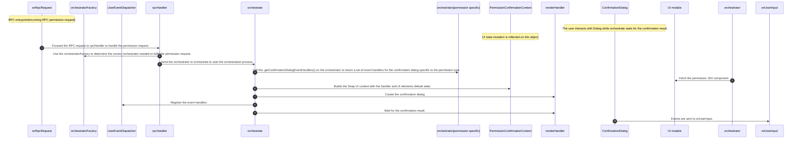
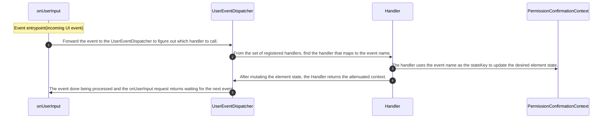

# Event Handling Architecture

## Overview

This document will provide an overview of the `MetaMask Smart Account Snap` internal event handling process that allows for user attenuation.

## Event handler registration Flow

The Event registration Flow diagram shows the path an incoming permission request takes to determine which event handlers are required to fulfill the permission.

## Event Handle Flow

The Event Handle Flow diagram shows the path of an event triggered by a user interaction to update the UI state dynamically.

