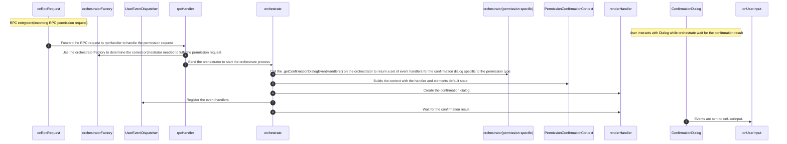
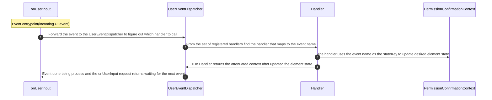

# Event Handling Architecture

## Overview

This document will provide a over of the MetaMask Smart Account Snap internal event handling process that allow for user attenuation.

## Event handler registration Flow(permission request)

The Event registration Flow diagram shows the path of an incoming permission request takes to determine which event handlers are required to fulfil the permission.

## Event Handle Flow
The Event Handle Flow diagram shows the path of an event triggered by a user interaction takes to dynamically update the UI state.

