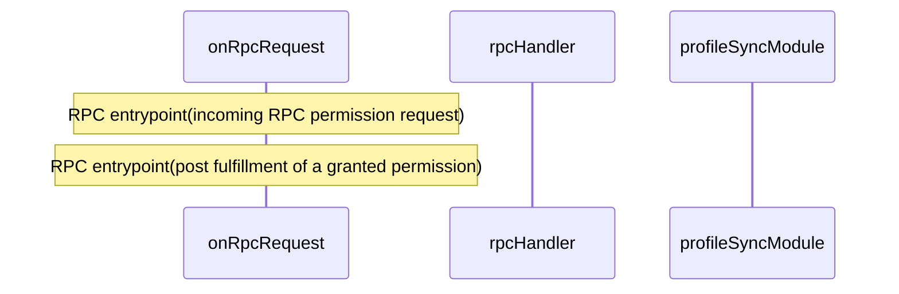
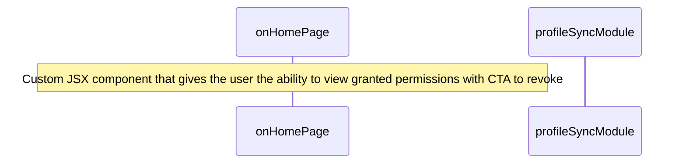
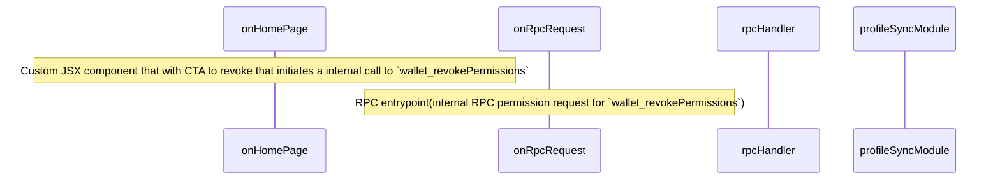

# Persisting Granted Permissions Architecture

## Overview

This document will provide an overview of the `@metamask/gator-permissions-snap` internal process for storing and retrieving a user's permissions.

The `@metamask/gator-permissions-snap` will automatically store granted permissions using MetaMask Profile Sync,

Pending `@metamask/gator-permissions-snap` reaching preinstall status, we will provide the user with the option to view the persisted permissions in the MetaMask extension to revoke them in the future via interaction with MetaMask Profile Sync in the extension codebase.

In the meantime(i.e., while `@metamask/gator-permissions-snap` is still a manual install), the `@metamask/gator-permissions-snap` will serve as the location where the user can view persisted permissions and initiate the revocation process.

**Useful links:**

- [@metamask/message-signing-snap](https://github.com/MetaMask/message-signing-snap) (its preinstalled in mobile or extension)
- [Profile sync SDK(i.e ProfileSyncController)](https://www.npmjs.com/package/@metamask/profile-sync-controller)

## Profile Sync SDK: OAuth 2.0 Authentication flow

- **IdentifierID**: We will use `SRP` identifier that uses the message signing snap to derived a public key.
- **Identifier Secret**: Using SRP as the identifier, we will derive the private key from the automatic message signing snap. The private key is used to signs a authentication message to allow the user to prove ownership of the `SRP` identifier.
- Snap Endowments: The `@metamask/gator-permissions-snap` `wallet_snap` is updated to allow communication with `@metamask/message-signing-snap`

```json
"wallet_snap": {
    "npm:@metamask/message-signing-snap": {},
    "npm:@metamask/permissions-kernel-snap": {}
}
```

```mermaid
sequenceDiagram
 autonumber
 participant @metamask/gator-permissions-snap
 participant @metamask/message-signing-snap
 participant profileSyncService

 @metamask/gator-permissions-snap->>@metamask/message-signing-snap: Call the messaging system to retrieve the identifier id
 @metamask/gator-permissions-snap->>@metamask/message-signing-snap: Call the messaging system to sign the profile sync authentication message
 @metamask/gator-permissions-snap->>profileSyncService: Verifies that the user owns the provided SRP by verifying the authentication message
 profileSyncService->>@metamask/gator-permissions-snap: Sends back a JWT identity token
 @metamask/gator-permissions-snap->>profileSyncService: Request and exchange of JWT identity token for a JWT access token
 profileSyncService->>@metamask/gator-permissions-snap: Sends a valid JWT access token
 @metamask/gator-permissions-snap->>profileSyncService: Uses the JWT access token to access protected resources(i.e granted permissions)
```

## Granted permissions store flow

The Granted permissions storage flow diagram shows the path an granted permission takes to during the permission request fulfill process to automatically storage permission encrypted by the user SRP.



## Granted permissions retrieval flow(view)

TBD



## Granted permissions revocation flow

TBD


